# Ready to use widgets

(🇹🇷) Projelerimde yararlı widget çözümleri kullanıyorum ve çoğu zaman orada kalıyor. Bunları hem ben hem de sizden gelenler ile birlikte biriktirip burada toplamak istiyorum. Eğer siz de katılmak isterseniz [bu dökümanı](https://github.com/VB10/flutter-ready-to-use-widgets/blob/master/github/rules/contribute.md#kendi-özel-widget-çözümümü-nasıl-paylaşırım) okumayı unutmayın.

(🇺🇸)I'm using more useful widgets on my bussines project or social project so I want to sum up all solutions only one repo with the community. If you want to contribute or want to add your solutions, please read to [rules](https://github.com/VB10/flutter-ready-to-use-widgets/blob/master/github/rules/contribute.md#kendi-özel-widget-çözümümü-nasıl-paylaşırım).

## List of core widget

# Container

<table>
  <tr>
    <td>Gradient Container</td>
    <td>Animated Scale Container</td> 
  </tr>
  
  <tr>
    <td>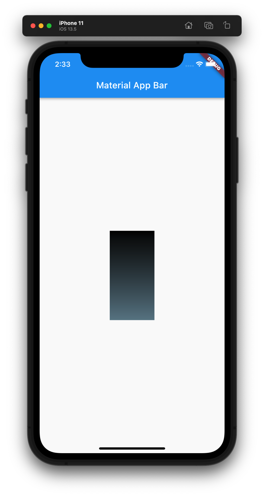</td>
    <td>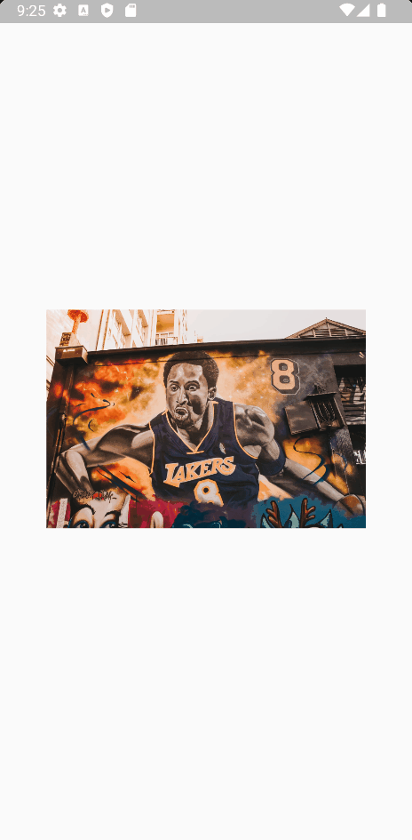</td>
  </tr>
  
</table>

# Custom Animated Container

<table>
  <tr>
    <td>Custom Animated Container</td>
  </tr>
  
  <tr>
    <td>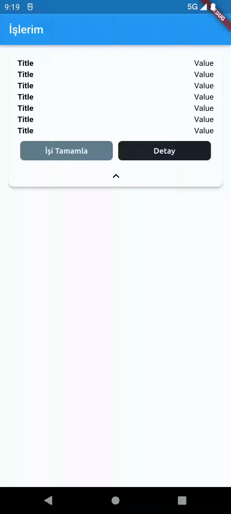</td>
  </tr>
  
</table>

# Wide Expansion Panel

<table>
  <tr>
    <td>Wide Expansion Panel</td>
  </tr>
  
  <tr>
    <td></td>
  </tr>
  
</table>

# Circular Progress

<table>
  <tr>
    <td>Loading Circular</td>
  </tr>
  
  <tr>
    <td>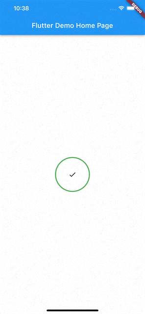</td>
  </tr>
  
</table>

# Dropdown

<table>
  <tr>
    <td>Searchable Dropdown With Paginated Request</td>
  </tr>
  
  <tr>
    <td>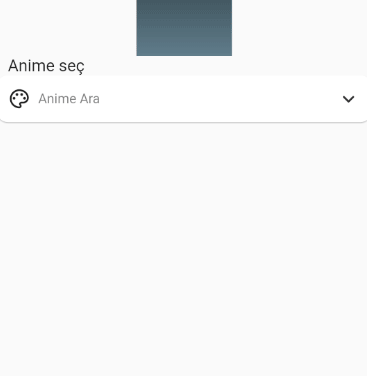</td>
  </tr>
  
</table>

# Button

<table>
  <tr>
    <td>Custom Elevated Button</td>
    <td>AsynchronousButton </td>
  </tr>
  
  <tr>
    <td>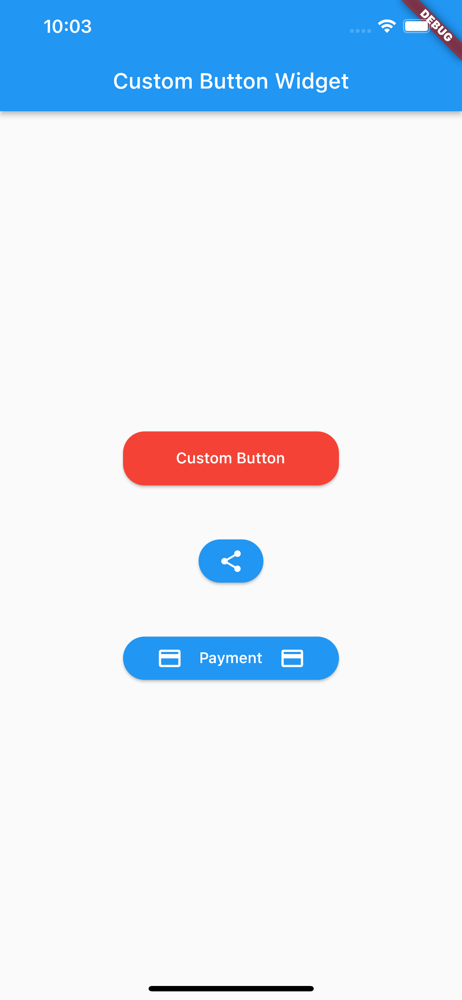</td>
    <td>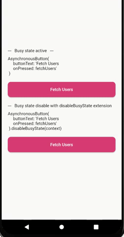</td>
  </tr>
  
</table>

# Alert Dialog

<table>
  <tr>
    <td>Custom Alert Widget</td>
  </tr>
  
  <tr>
    <td>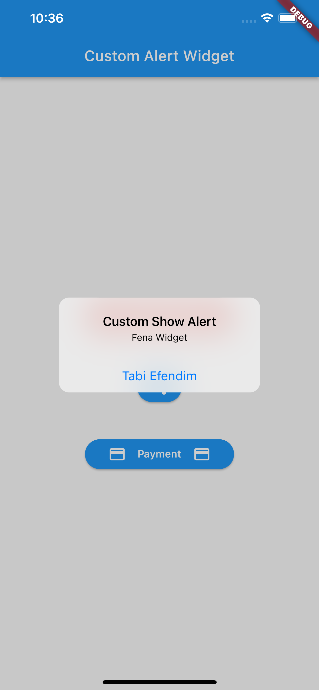</td>
  </tr>
  
</table>

# Custom Text Field

<table>
  <tr>
    <td> Custom Text Field </td>
  </tr>
  
  <tr>
    <td></td>
  </tr>
  
</table>

# Custom Text Field

<table>
  <tr>
    <td> Custom Text Field GIF</td>
    <td> Custom Text Field PNG</td>
  </tr>
  
  <tr>
    <td></td>
     <td>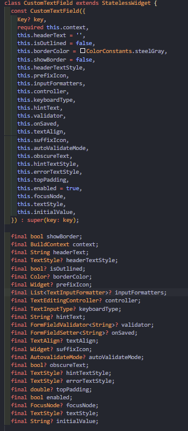</td>
  </tr>
  
</table>

# Info Message Panel

<table>
  <tr>
    <td>Info Message Panel GIF</td>
    <td>Info Message Panel PNG</td>
  </tr>
  
  <tr>
    <td></td>
     <td>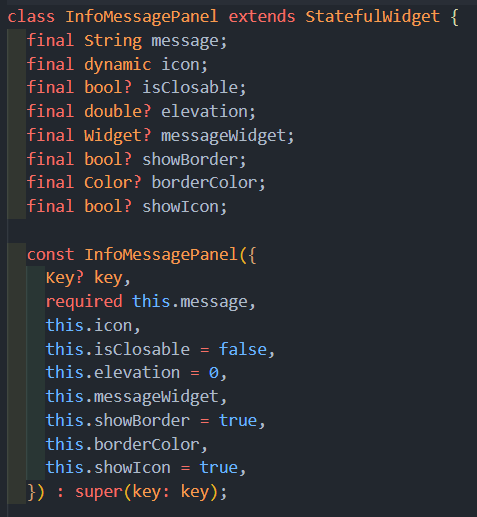</td>
  </tr>
  
</table>

# FacePile

<table>
  <tr>
    <td> FacePileStack </td>
  </tr>
  
  <tr>
  <td></td>
  </tr>
  
</table>

# ToolBar

| Name                     | Readme                                                                                                    |
| ------------------------ | --------------------------------------------------------------------------------------------------------- |
| Dynamic Cool ToolBar      | [Readme](github/gifs/toolbar/dynamic_cool_tool_bar.gif)  | 

# Checkbox

<table>
  <tr>
    <td> Generic Group Checkbox </td>
    <td> Generic Group Checkbox </td>
  </tr>
  
  <tr>
    <td>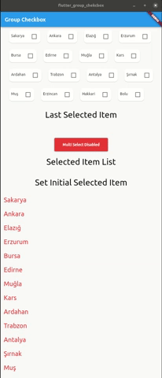</td>
     <td>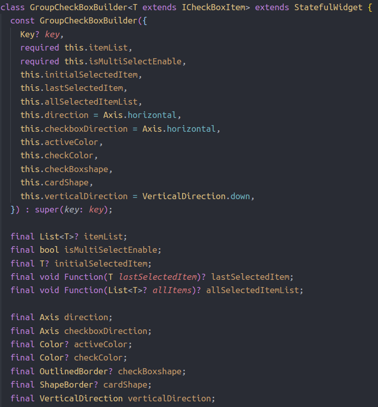</td>
  </tr>
  
</table>

# Color Constants

<table>
  <tr>
    <td>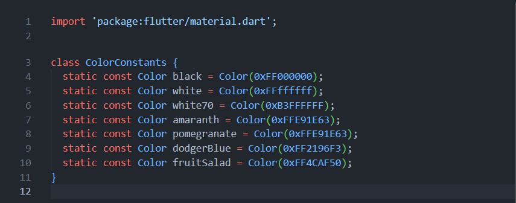</td>
  </tr>
  <tr>
    <td>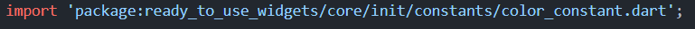</td>
  </tr>
   <tr>
    <td></td>
  </tr>
</table>

# Divider

| Name                     | Readme                                                                                                    |
| ------------------------ | --------------------------------------------------------------------------------------------------------- |
| Custom Text Divider      | [Readme](github/gifs/divider/custom_text_divider.gif)  | 

# Scrollbar

| Name                     | Readme                                                                                                    |
| ------------------------ | --------------------------------------------------------------------------------------------------------- |
| Custom Scrollbar         | [Readme](github/gifs/scrollbar/custom_scrollbar.gif)  | 

# TextField

| Name                     | Readme                                                                                                    |
| ------------------------ | --------------------------------------------------------------------------------------------------------- |
| Custom Password Field                | [Readme](github/gifs/textfield/custom_password_field.gif)  | 

# SnackBar

| Name                     | Readme                                                                                                    |
| ------------------------ | --------------------------------------------------------------------------------------------------------- |
| Custom Snackbar                | [Readme](github/gifs/snackbar/custom_snackbar.gif)  | 

# Image

| Name                                       | Video(Gif or Image)                                                        |
| ------------------------------------------ | -------------------------------------------------------------------------- |
| Glow Image | [Gif](github/gifs/image/glow_image.gif)                                                           |

## Feature Widget

=======

# Chart

# Widget Slider

| Name                     | Readme                                                                                                    |
| ------------------------ | --------------------------------------------------------------------------------------------------------- |
| WidgetSlider             | [Readme](https://github.com/MehmetKaranlik/flutter-ready-to-use-widgets/blob/master/lib/feature/widget_slider/Readme.md)  | 
| CSV Chart.               | [Readme](https://github.com/burakJs/flutter-ready-to-use-widgets/blob/master/lib/feature/chart/Readme.md)  | 

<table>
  <tr>
     <td> Network Dependent Widget</td>
  </tr>
  
  <tr>
      <td> 
  </tr>
  
</table>

                                  

# Bottom List Picker

| Name                     | Readme                                                                                                    |
| ------------------------ | --------------------------------------------------------------------------------------------------------- |
| Bottom List Picker                | [Readme](lib/feature/bottomlistpicker/readme.md)  | 
[Gif](github/gifs/bottomlistpicker/bottom_list_picker.gif)
| Bottom List Picker                | [Readme](github/gifs/bottomlistpicker/bottom_list_picker.gif)  | 

# Circle Avatar Image And Alphabet

<table>
  <tr>
    <td> Circle Avatar Image And Alphabet </td>
  </tr>
  
  <tr>
    <td></td>
  </tr>
  
</table>
                                                                                      
 [Readme](lib/feature/circle_avatar_image_and_alphabet/readme.md)

# Rating Bar

<table>
  <tr>
    <td> Heart Icon Bar </td>
    <td> Star Icon Bar </td>
  </tr>
  
  <tr>
    <td>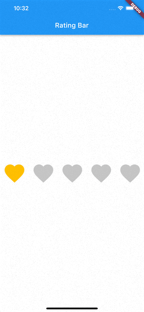</td>
    <td>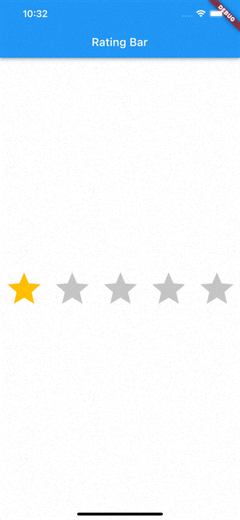</td>
# Stacked Images Widget

<table>
  <tr>
    <td>Stacked Images</td>
  </tr>
  
  <tr>
    <td></td>
  </tr>
  
</table>

# Custom Side Bar
<table>
  <tr>
    <td>Custom Side Bar</td>
  </tr>
  
  <tr>
    <td>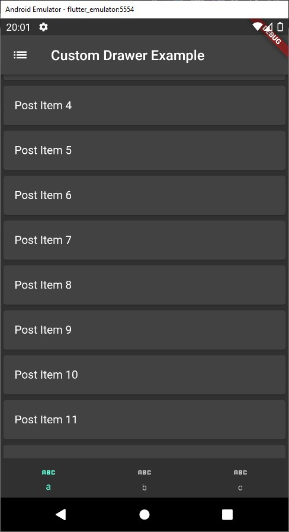</td>
    <td>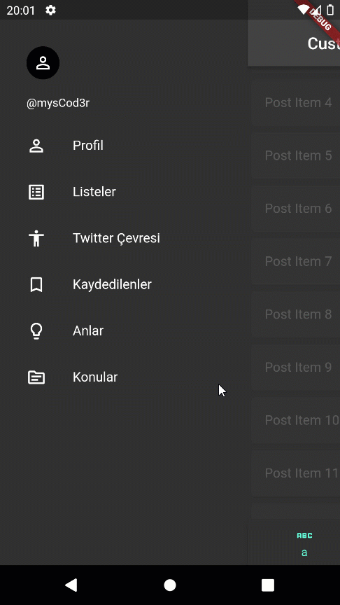</td>
    <td>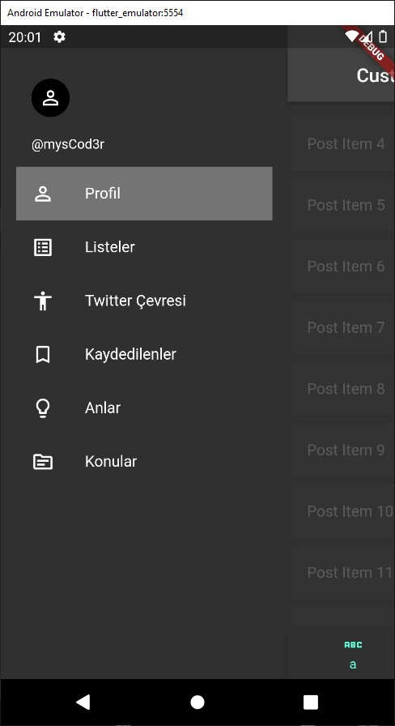</td>
  </tr>
  
</table>